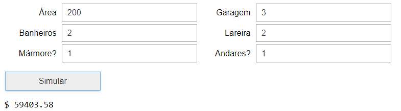

<!DOCTYPE html>
<html lang="pt-br">
<head>
    <meta charset="UTF-8">
    <meta http-equiv="X-UA-Compatible" content="IE=edge">
    <meta name="viewport" content="width=device-width, initial-scale=1.0">
    <title>Simulador</title>
</head>
<body>
    <h1>Simulador para previsão do preço de imóveis</h1>
    <h3>Sobre o projeto</h3>
    
O projeto em questão foi criado com objetivo de prever o valor do imóvel de acordo com suas características variando entre tamanho da área, garagem, banheiros entre outras

    <h3>Sobre os dados</h3>
    
Os dados utilizados nesse modelo de regressão linar foram extraidos da plataforma Kaggle, são dados fictícios utilizados para realizar treinamentos e testes de machine learning
    
Fonte: <a href="https://www.kaggle.com/greenwing1985/housepricing">https://www.kaggle.com/greenwing1985/housepricing</a>

    <h3>Objetivo do projeto</h3>
    
O princial objetivo desse modelo é prever o valor do preço do imóvel utilizando as informações das variáveis explicativas aplicadas ao modelo de regressão linear

    <h3>Dados</h3>
    <ul>
        <li><b>precos</b> - Preços do imóveis</li>
        <li><b>area</b> - Área do imóvel</li>
        <li><b>garagem</b> - Número de vagas de garagem</li>
        <li><b>banheiros</b> - Número de banheiros</li>
        <li><b>lareira</b> - Número de lareiras</li>
        <li><b>marmore</b> - Se o imóvel possui acabamento em mármore branco (1) ou não (0)</li>
        <li><b>andares</b> - Se o imóvel possui mais de um andar (1) ou não (0)</li>
    </ul>
    <h3>Como o projeto foi criado</h3>
    
Como informado anteriormente os dados utilizados para a criação desse modelo foram criados aleatoriamente, estão a sua compatibilidade com dados reais pode não ser tão intíma.

    
Para execução do modelo foram utilizados as seguintes bibliotecas:

    <ol>
        <li>Pandas</li>
        <li>Numpy</li>
        <li>Matplotlib</li>
        <li>Seaborn</li>
    </ol>
    
O passo a passo seguido estão descritos abaixo:

    <ol>
        <li>Análise da estatística descritiva</li>
        <li>Análise da Matriz de correlação</li>
        <li>Análises gráficas entre as variáveis explicativas</li>
        <li>Análise da distribuição de frequência</li>
        <li>Estimação do modelo de regreção linear</li>
        <li>Análise da matriz de regressão</li>
        <li>Criação do simulador</li>
        <li>Salvando e carregando o modelo</li>
    </ol>
    <h3>Prévia do projeto</h3>
    
     
     
    
Os detalhes sobre a estruturação e criação do modelo podem ser verificados no notbook "Modelo de regressão linear.ipynb" nesse repositório

    
O simulador executável pode ser acessado no notbook "simulador.ipynb" também nesse repositório

    
Este é um projeto iniciante! futuramente desenvolverei modelos mais completos

</body>
</html>
